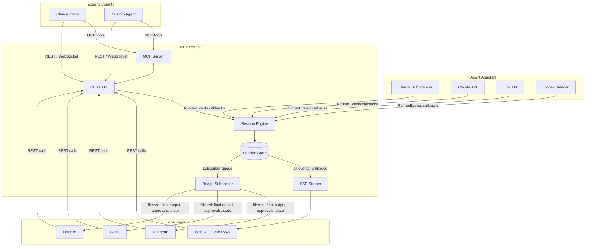
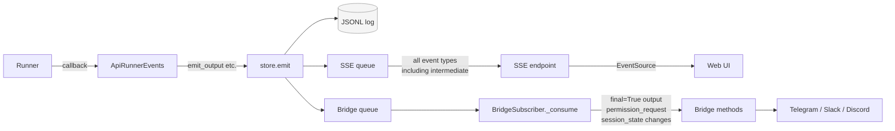
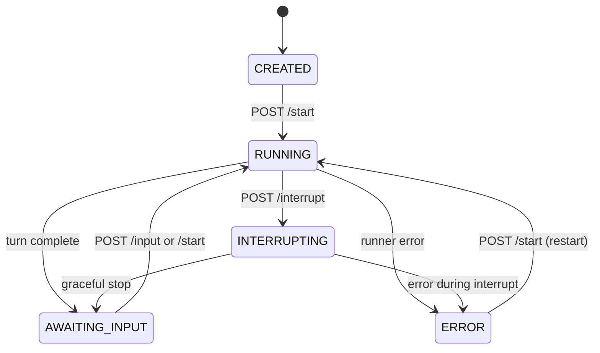
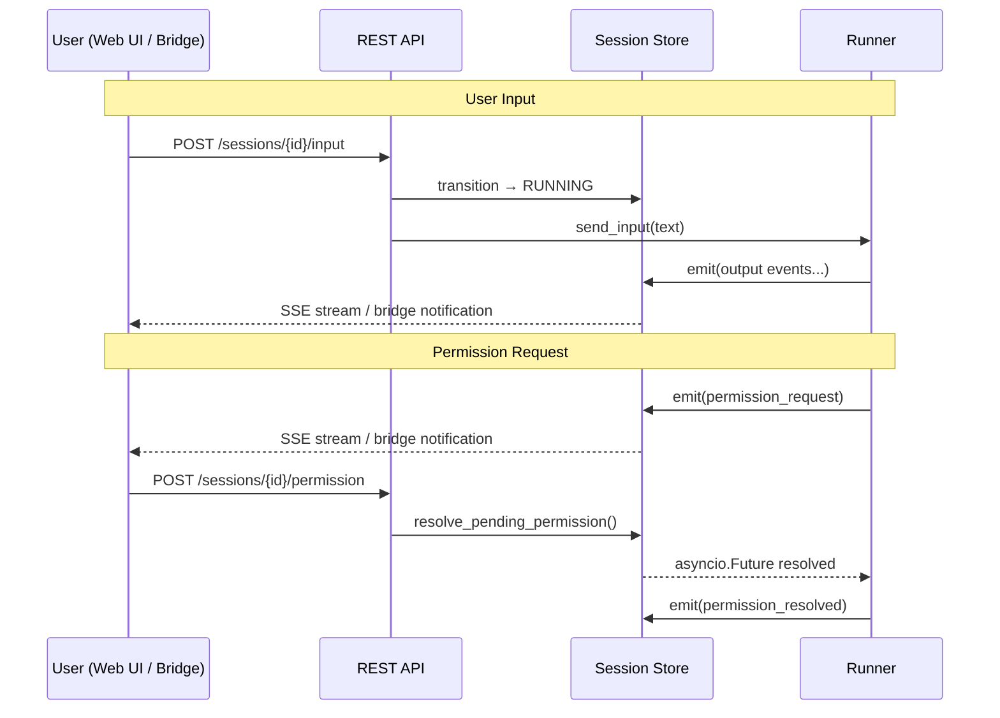

# Architecture

Visual overview of Tether's structure. See the linked docs for details.

## System Overview

Runners and external agents produce events. The session engine persists them to the store,
which broadcasts to subscriber queues. Two independent consumers read those queues — the
SSE stream (raw passthrough for the web UI) and bridge subscribers (filtered, server-side
rendering for messaging platforms). All consumers send input back through the same REST API.

See: [Runners](RUNNERS.md) · [Session Engine](SESSION_ENGINE.md) · [Bridges](BRIDGES.md) · [Web UI](WEB_UI.md) · [MCP Server](MCP_SERVER.md)

## Event Flow

How a single event travels from a runner to all consumers.

The store appends every event to the JSONL log and pushes it to every subscriber queue.
SSE forwards everything — the Vue app decides what to render. The bridge subscriber
filters aggressively: only final output, permission requests, and state transitions
reach the messaging platform.

See: [Session Engine > Event Distribution](SESSION_ENGINE.md#event-distribution)

## Session Lifecycle

Transitions are enforced by `api/state.py` with per-session async locks.
Invalid transitions return HTTP 409.

See: [Data Model](DATA_MODEL.md) · [Session Engine](SESSION_ENGINE.md)

## Interaction Loop

How user input and approval responses flow back to the runner.

Bridges add an auto-approve layer: `check_auto_approve()` in the bridge base class
can resolve permissions without user interaction when allow-all or allow-tool timers
are active.

See: [API Reference](API_REFERENCE.md) · [Bridges > Auto-Approve](BRIDGES.md#auto-approve-system)
