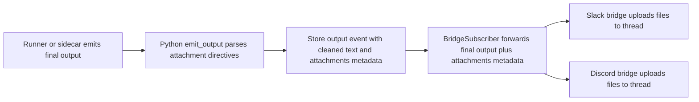

# Dev Plan: Attachment Publishing and STOP Footer

## Goal

Add two related behaviors to Tether:

1. If an agent's final report explicitly asks to publish a file as an attachment, Tether should upload that file into the tethered Slack or Discord thread.
2. Every completed agent response should end with a final STOP line that includes a status emoji and the total execution time, regardless of whether the turn succeeded, failed, or was interrupted.

This plan is written against the current Tether architecture in this repo, not as a generic proposal.

## Current State

### Final output flow today

- TypeScript sidecars emit `output`, `metadata`, `heartbeat`, and `exit` events.
- The Codex sidecar emits the final assistant text immediately on `item.completed` for `agent_message`.
- The OpenCode sidecar emits step output during streaming and a final output marker when a step finishes.
- The Python runner layer forwards those events through `ApiRunnerEvents`.
- `emit_output()` in the Python API layer emits `output` and also builds an aggregated `output_final` blob.
- `BridgeSubscriber` forwards only `output` events with `final=True` to Slack and Discord.
- `BridgeSubscriber` explicitly skips `output_final`.

### Timing data today

- Both TypeScript sidecars already emit `heartbeat(done=true)` and `metadata(duration_ms=...)` in their `finally` blocks.
- That `duration_ms` metadata arrives after the final output text has already been emitted.
- Because of that ordering, Tether does not currently have a shared point where it can guarantee that the visible final report already includes the total elapsed time.

### Bridge capabilities today

- Slack and Discord bridges currently only send plain text for `on_output()`.
- The local Tether wrappers subclass upstream `agent_tether` bridges, so new attachment behavior should be implemented in the checked-in local wrappers rather than by patching the venv directly.
- `BridgeSubscriber` already passes a `metadata` argument to bridge `on_output()`, but today it only contains final/kind flags and no attachment payload.

## Recommended Product Semantics

### Attachment directive

Use an explicit line-oriented directive inside the final report:

```text
PUBLISH AS ATTACHMENT: relative/or/absolute/path/to/file.ext
```

Recommended compatibility rule:

- Accept both `PUBLISH AS ATTACHMENT:` and the misspelled `PUBLISH AS ATTACHEMENT:` as aliases.
- Only parse these directives in final output, never in step output.
- Strip these directive lines from the human-visible final message before it is posted to Slack or Discord.

### Footer format

Append exactly one last line to the final visible report:

```text
STOP <emoji> <elapsed>
```

Recommended emoji mapping:

- Success / awaiting input: `🛑✅`
- Error: `🛑❌`
- Interrupted / aborted: `🛑⏹️`

Recommended elapsed format:

- Human-oriented compact duration such as `12s`, `4m 03s`, or `1h 02m 11s`

## Recommended Architecture

### Attachment publishing

Implement attachment parsing in the shared Python event pipeline, not in Slack/Discord only.

Why:

- It covers Codex sidecar, OpenCode sidecar, and external agents that push events through `/api/sessions/{id}/events`.
- It keeps the parsing logic centralized.
- It allows the same cleaned final text and attachment metadata to be reused by all delivery paths.

Recommended flow:



Implementation direction:

- Extend `emit_output()` so final output is normalized through a helper like `extract_publish_attachments(session, text)`.
- The helper should return:
  - cleaned final text
  - resolved attachment descriptors
  - parse or validation warnings
- Add an `attachments` field to emitted `output` event data for final messages.
- Teach `BridgeSubscriber` to forward `attachments` through `metadata` instead of dropping them.
- Teach local Slack and Discord bridges to upload those attachments after posting the cleaned final text.

### STOP footer

Implement footer composition at a shared finalization point in the Python layer, not separately in each bridge.

Why:

- The requirement says "always emit" the last line, which should apply to all consumers, not just Slack/Discord.
- The current sidecar ordering emits `duration_ms` after final output, so bridge-only decoration would not make the stored or UI-visible report consistent.
- A shared finalization point can unify Codex, OpenCode, Claude, Pi, and external-agent paths.

Recommended model:

- Add per-session runtime fields for:
  - pending final output text
  - pending attachment descriptors
  - final duration
  - terminal status
- When a runner emits `kind="final"`, store it as pending final output instead of immediately treating it as the fully rendered end-user message.
- When the turn reaches its terminal transition (`AWAITING_INPUT`, `ERROR`, or explicit stop), compose:
  - cleaned final text
  - footer line
  - final attachment metadata
- Emit the rendered final output once from that shared point.

This is the more invasive part of the feature, but it is the only approach that cleanly satisfies the "last line" requirement across all surfaces.

## File-Level Implementation Plan

### 1. Define attachment parsing and validation

Add a new helper module in the Python agent layer, for example:

- `agent/tether/output_postprocess.py`

Responsibilities:

- Parse attachment directive lines from final output text.
- Resolve relative paths against `session.directory` or managed workdir.
- Reject unsafe paths after `realpath()` normalization.
- Enforce limits:
  - regular readable file only
  - maximum attachment count
  - maximum file size
  - optional allowed-root restriction
- Return structured attachment records plus cleaned text.

Recommended safety rule:

- Only allow attachments whose resolved path stays under the session directory or managed workdir unless an explicit config override is added later.

### 2. Extend runtime state for finalization

Update:

- `agent/tether/store.py`

Add runtime fields such as:

- `pending_final_text`
- `pending_final_attachments`
- `pending_final_kind`
- `pending_terminal_state`
- `duration_ms`

This lets the Python layer hold the final text until it knows both elapsed time and terminal outcome.

### 3. Update output emission pipeline

Update:

- `agent/tether/api/emit.py`
- `agent/tether/api/runner_events.py`

Tasks:

- Parse final output through the new postprocessor.
- Preserve attachment metadata on final output events.
- Stop treating the first final output chunk as the final rendered user-facing message.
- Add a helper to compose the STOP footer from terminal status plus duration.
- Emit the rendered final output from the finalization point.

Recommended footer composition helper:

- `render_stop_footer(status: str, duration_ms: int | None) -> str`

### 4. Finalize on terminal transition

Update:

- `agent/tether/api/runner_events.py`
- possibly `agent/tether/api/sessions.py` for external-agent `status=done/error`

Tasks:

- On `on_awaiting_input()`, `on_error()`, and explicit stop/interrupt paths, finalize any pending final output before or alongside the state transition event.
- Ensure exactly one STOP footer is emitted.
- Define precedence if both error and pending final output exist.

Recommended order:

1. determine terminal status
2. finalize visible final output with footer
3. emit state transition
4. let bridges react as they already do

### 5. Thread metadata through the bridge subscriber

Update:

- `agent_tether/subscriber.py` behavior as mirrored by local tests
- local compatibility layer tests in `agent/tests/test_subscriber.py`

Tasks:

- Preserve `attachments` metadata from final `output` events.
- Flush buffered step output before final output, as today.
- Pass metadata through to bridge `on_output(session_id, text, metadata=...)`.

Do not use `output_final` for Slack/Discord delivery in phase 1 unless the finalization work moves there explicitly. The existing subscriber intentionally skips `output_final`, so the plan should keep one clear source of truth.

### 6. Implement Slack attachment upload

Update:

- `agent/tether/bridges/slack/bot.py`

Tasks:

- Override or extend `on_output()` to inspect `metadata.attachments`.
- After posting the cleaned final text, upload files into the same thread.
- Use Slack's file-upload API for threaded uploads.
- Post a short failure notice in-thread if a requested attachment cannot be uploaded.

Behavioral rule:

- If text succeeds but one attachment fails, keep the final text and report the upload failure as a follow-up status message.

### 7. Implement Discord attachment upload

Update:

- `agent/tether/bridges/discord/bot.py`

Tasks:

- Override or extend `on_output()` to inspect `metadata.attachments`.
- After posting the cleaned final text, upload files into the same Discord thread.
- Use `discord.File(...)` and send as thread attachments.
- Mirror Slack failure behavior.

### 8. Add config knobs

Update:

- `agent/tether/settings.py`
- `.env.example`
- `docs/API_REFERENCE.md`
- `docs/BRIDGES.md`
- `docs/DATA_MODEL.md`

Suggested settings:

- `TETHER_ATTACHMENT_PUBLISH_ENABLED=1`
- `TETHER_ATTACHMENT_PUBLISH_MAX_FILES=5`
- `TETHER_ATTACHMENT_PUBLISH_MAX_BYTES=...`
- `TETHER_ATTACHMENT_PUBLISH_ALLOW_OUTSIDE_SESSION_DIR=0`
- `TETHER_STOP_FOOTER_ENABLED=1`

### 9. Update sidecar tests and contract expectations

Update:

- `codex-sdk-sidecar/src/codex.test.ts`
- `opencode-sdk-sidecar/src/opencode.test.ts`
- `agent/tests/test_runner_events.py`
- `agent/tests/test_api.py`
- `agent/tests/test_subscriber.py`
- `agent/tests/test_slack_bridge.py`
- `agent/tests/test_discord_bridge.py`

Test cases to add:

- final output containing one valid attachment directive
- multiple attachment directives in one final report
- invalid path, unreadable path, oversized file, path escape via symlink or `..`
- final report text is cleaned before bridge delivery
- STOP footer is appended exactly once
- success, error, and interrupt footer variants
- footer duration matches emitted timing data
- attachment upload failure does not suppress the final text
- external-agent event path also gets attachment parsing and footer rendering

## Suggested Delivery Phases

### Phase 1: Attachment publishing for Slack and Discord

- Add final-output parsing
- Emit attachment metadata
- Upload files from local Slack and Discord bridge wrappers
- Keep the current final output timing behavior unchanged

This delivers the file-publishing feature with relatively low risk.

### Phase 2: Shared STOP footer finalization

- Introduce pending-final-output runtime state
- Finalize rendered final output from the Python layer
- Make footer rendering consistent across bridges, UI, and CLI

This is the architectural change that satisfies the "always emit last line" requirement correctly.

### Phase 3: Optional UI and API polish

- Show attachments in the web UI as downloadable artifacts
- Expose attachment metadata in API docs and event typings
- Optionally show the terminal outcome and elapsed time in structured UI fields in addition to the footer text

## Main Risks

| Risk | Why it matters | Mitigation |
| --- | --- | --- |
| Arbitrary file exfiltration | An agent could request publishing sensitive local files. | Restrict attachments to session-scoped roots by default and validate with `realpath()`. |
| Footer duplication | Multiple terminal paths already exist (`awaiting_input`, `error`, stop, sidecar exit). | Centralize finalization and add "exactly once" tests. |
| Behavior drift between adapters | Codex/OpenCode sidecars and external agents do not emit identical event sequences. | Implement footer logic in the shared Python layer, not only in one sidecar. |
| Bridge API mismatch | Existing `on_output()` only assumes plain text. | Reuse the existing `metadata` parameter instead of changing the abstract signature first. |
| Platform upload failures | Slack/Discord upload APIs can fail independently of text sends. | Keep message send and attachment upload separate, with follow-up error reporting. |

## Open Decisions

1. Should the canonical directive be only `ATTACHMENT`, or should Tether permanently support the misspelled `ATTACHEMENT` alias for compatibility?
2. Should the STOP footer be visible in the web UI and CLI exactly as written, or only in messaging bridges?
3. Should attachment paths be allowed outside the session directory behind an explicit config flag, or should that remain unsupported?
4. Should attachment directives be removed from stored event text, or only stripped at render time for bridge delivery?

## Recommended First Cut

If implementation starts immediately, the safest first cut is:

1. Ship attachment parsing and Slack/Discord uploads first.
2. Keep footer work behind a second branch because it changes the final-output lifecycle.
3. Make the footer logic shared in Python rather than per-bridge, even if that means a slightly larger refactor.
